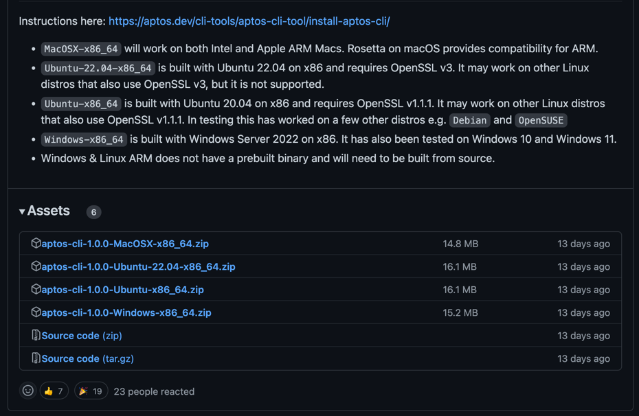
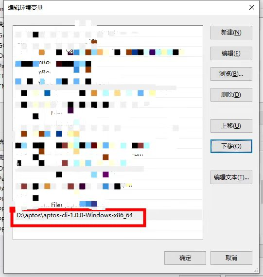
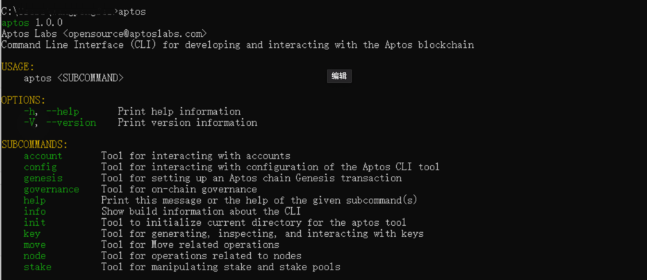
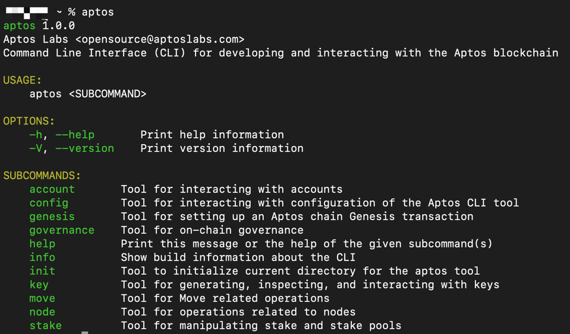
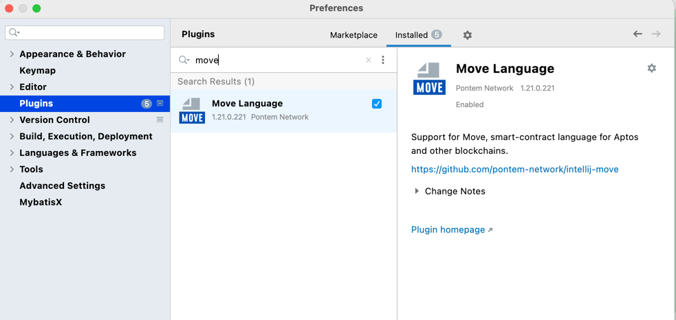
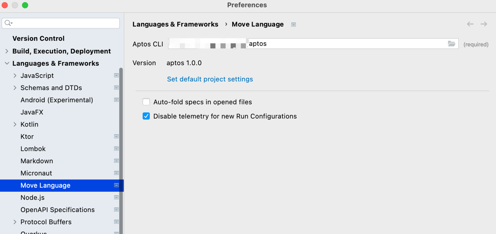
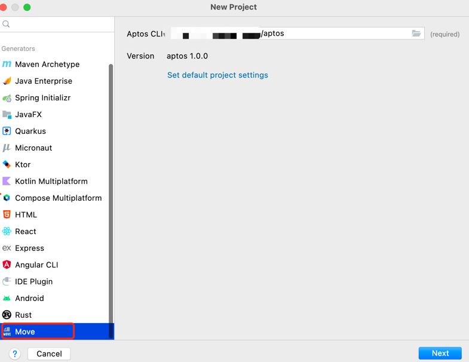

# move本地开发环境构建
> 本教程是基于aptos搭建的move智能合约开发
## 1.安装aptos cli
根据不同的操作系统，下载最新的[aptos cli](https://github.com/aptos-labs/aptos-core/releases)


### 1.1、windows
aptos-cli下载下来后，将压缩包解压到相应的路径，然后将其配置到环境变量中即可全局使用 aptos cli



环境变量配置成功，在cmd下敲aptos,看到如下图，即说明aptos cli安装成功



### 1.2、mac os
同windows一样，解压完后，配置到环境变量中

```shell
sudo vi ~/.bash_profile

export PATH="{your aptos_cli path}:$PATH"
```
环境变量配置成功,在终端下敲aptos,看到如下图，即说明aptos cli安装成功




## 2.在 Intellij IDEA中安装 Move Language插件



插件安装成功后，在IDEA的设置里找到Languages & Frameworks>Move Languages,将Aptos CLI的目录选择你刚刚解压后的目录下即可




配置成功后即可在IDEA中创建move工程了



---

> 至此move在idea下的开发环境已经搭建好，接下来我们开始move入门 move hello world
