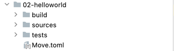
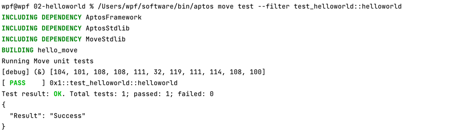
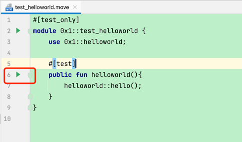

# move hello world
> 本教程是基于aptos搭建的move智能合约开发

## 1.创建一个move工程，工程名为02-helloworld,其工程目录如下:



+ 02-helloworld       ---- 工程名
    + build           ---- 编译后的文件
    + sources         ---- 源文件，合约代码放在这里
    + tests           ---- 测试脚本存放的位置
    + Move.toml       ---- Aptos项目的包管理工具使用的是Cargo。Cargo的作用和Python的pip，Nodejs的npm类似。后面会详细说明


## 2.在sources目录下创建一个名为helloworld的move module，编写代码如下:
```move
module 0x1::helloworld {
    use aptos_std::debug::print;
    public fun hello() {
        print(&b"hello world");
    }
}
```


## 3.在tests目录下创建一个名为test_helloworld的move test module，编写脚本如下:
```move
#[test_only]
module 0x1::test_helloworld {
    use 0x1::helloworld;

    #[test]
    public fun helloworld(){
        helloworld::hello();
    }
}
```

## 4.执行测试脚本
### 4.1 命令行的方式执行
```shel1
/Users/wpf/software/aptos move test --filter test_helloworld::helloworld
```




### 4.2 通过idea的的可视化按钮快速运行




> 注：实际控制台输出的是 [debug] (&) [104, 101, 108, 108, 111, 32, 119, 111, 114, 108, 100]  对应其ascii码，其原理将会在vector这节讲述。

> 注：如果首次运行出现这样的错误：
```json
{
  "Error": "Move compilation failed: Unable to resolve packages for package 'move2': While resolving dependency 'AptosFramework' in package 'move2': While processing dependency 'AptosFramework': Unable to find package manifest for 'AptosFramework' at \"/Users/wpf/.move/https___github_com_aptos-labs_aptos-core_git_main/aptos-move/framework/aptos-framework\""
}
```
>解决方式如下：
> 创建错误中提示的文件路径(windows同理)：/Users/wpf/.move/https___github_com_aptos-labs_aptos-core_git_main
> 
> 然后在/https___github_com_aptos-labs_aptos-core_git_main 这个目录下执行git clone git@github.com:aptos-labs/aptos-core.git 
> 
> 若clone失败，也可以直接去[aptos-core](https://github.com/aptos-labs/aptos-core)直接下载改代码，然后放入该路径下即可。
> 
> 另外的一直方式请详细看:[09-move-dependence.md](https://github.com/wpf008/hello_move/blob/master/01-%E6%9E%84%E5%BB%BAmove%E5%BC%80%E5%8F%91%E7%8E%AF%E5%A2%83/09-move-dependence.md)

---

> 至此move的环境搭建是否成功已得到验证且使用move语言开发helloworld程序已经完成，接下来我们开始move基本语法。
