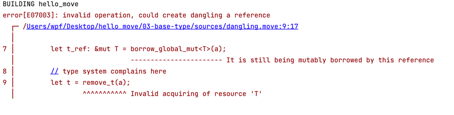

# ```move中的结构、泛型与资源```

> 本教程是基于aptos搭建的move智能合约开发

## 1.struct

### 1.1 struct 介绍

> ```struct``` 是由一批数据组合而成的结构型数据。组成结构型数据的每个数据称为结构型数据的“成员”。
>
>结构可以存储任何非引用类型，包括其他结构，无法再存储自身结构，即结构不能递归。
>
> 默认情况下，结构是线性的和短暂的。即不能被复制，不能被删除，不能被存储在全局存储中。 这意味着所有值都必须转移所有权（线性），并且必须在程序执行结束时处理这些值。
>
> 我们可以通过赋予 ```struct``` 允许```copy```或```drop```以及存储在全局存储中或定义全局存储模式的能力来实现这种行为。
>
> 如果结构值无法复制且无法删除，我们通常将其称为**资源**。在这种情况下，资源值必须在函数结束时转移所有权。此属性使资源特别适合用于定义全局存储模式或表示重要值（例如令牌）。
>

### 1.2 struct 定义

+ 结构必须在模块内定义
+ 结构必须以大写字母A-Z开头,后面可以使用A-Z、a-z、0-9、_
+ 结构体中可以定义0-65535个字段
+ **结构类型只能在定义结构的模块内创建（“打包”）、销毁（“解包”）。**
+ **结构的字段只能在定义结构的模块内部访问。**

> 结构的语法

```move
//<T1,T2>表示结构的泛型  []表示可选
struct struct_name<T1, T2> [has] [key | copy | drop | store] {
    filed_01: T1,
    filed_02: T2,
    filed_03:Type_03,
    ....
    filed_n: Type_n
}

```

### 1.2.1 默认情况下，结构声明是线性且短暂的

```move
module sender::Coin {
    use std::string;

    struct OtherInfo {}

    struct CoinInfo {
        name: string::String,
        symbol: string::String,
        decimals: u8,
        supply: u128,
        cap: u128,
        otherInfo: OtherInfo,
        //c:CoinInfo,//error Circular reference of type 'CoinInfo'
    }
}
```

### 1.2.2 结构声明具有```copy``` ```drop``` ```store```能力,此时结构体具有复制、删除、将其存储在全局存储中或将其用作存储模式

```move
module sender::Coin {
    use std::string;
    struct OtherInfo has copy, drop {}
    struct CoinInfo has copy, drop {
        name: string::String,
        symbol: string::String,
        decimals: u8,
        supply: u128,
        cap: u128,
        otherInfo: OtherInfo,
    }
}
```

### 1.2.3 使用泛型的结构定义

```move
module sender::Coin {
    use std::string;
    struct OtherInfo has copy, store, drop {}
    struct CoinInfo<T> has copy, store, drop {
        name: string::String,
        symbol: string::String,
        decimals: T,
        supply: u128,
        cap: u128,
        otherInfo: OtherInfo,
    }
}
```

### 1.3 struct 创建与使用

```move
//在Coin.move模块里定义了一个创建CoinInfo的方法
public fun new_CoinInfo(name: string::String, symbol: string::String): CoinInfo {
    let otherInfo = OtherInfo {};
    CoinInfo {
        name, symbol, decimals: 10, supply: 10, cap: 10, otherInfo
    }
}
//在Coin.move模块里定义了一个可修改supply的函数
public fun setSupply(coinInfo: &mut CoinInfo, supply: u128) {
    coinInfo.supply = supply;
}

//在test_struct_resource.move实际去创建结构体并修改结构体属性
#[test]
public fun test_struct() {
    let coin = Coin::new_CoinInfo(string::utf8(b"test"), string::utf8(b"T"));
    print(&coin);
    Coin::setSupply(&mut coin, 100);
    print(&coin);
}
```

## 2.泛型(generics)

> 泛型是允许程序员在强类型程序设计语言中编写代码时使用一些以后才指定的类型，在实例化时作为参数指明这些类型。
>
> 函数和结构都可以在其签名中采用类型参数列表，并用一对尖括号括起来<...>

### 2.1 定义函数时使用泛型

```move
fun fun_name<T>(x: T): T {
    // this type annotation is unnecessary but valid
    (x: T)
}
```

### 2.2 定义结构时使用泛型

```move
struct Foo<T> has copy, drop { x: T }

struct Bar<T1, T2> has copy, drop {
    x: T1,
    y: vector<T2>,
}
```

### 2.3 ```phantom```类型的泛型

> 在结构定义中，可以通过在声明之前添加```phantom```关键字来将类型参数声明为```phantom```。 如果一个类型参数被声明为```phantom```，我们就说它是幻像类型参数。
>
> 被```phantom```修饰的类型参数将不参与结构的能力推导。这样在派生泛型类型的能力时，不考虑幻像类型参数的参数，从而避免了对虚假能力注释的需要。
>
> 定义结构时，```Move```的类型检查器确保每个幻像类型参数要么不在结构定义中使用，要么仅用作幻像类型参数的参数。

```move
//不在结构定义中使用泛型
struct A< phantom T1, T2> {
    foo: T2
}
//仅用作幻像类型参数的参数
struct B< phantom T> {
    a: A<T, u8>
}
```

---

## 3.resources

> 只有具有```key```能力的结构才能直接保存在持久性全局存储中。存储在这些key结构中的所有值都必须具有这种```store```能力。
>
> ```move``` 语言可以使用以下五个指令在全局存储中创建、删除和更新资源:

| 方法                                    | 描述                         | 是否会abort              |
|:--------------------------------------|:---------------------------|:-------------|
| move_to<T>(&signer,T)                 | 发布一个资源存储到&signer账号下        | 如果signer.address已经持有T |
| move_from<T>(address): T              | 移除address地址下的资源T，并返回资源T    | 如果address不持有T         |
| borrow_global_mut<T>(address): &mut T | 返回存储在address下的资源T的可变引用     | 如果address不持有T         |
| borrow_global<T>(address): &T         | 返回存储在address下的资源T的不可变引用    | 如果address不持有T         |
| exists<T>(address): bool              | 判断address下是否存在资源T          | 不会                    |

> 这些指令中的泛型T具有```key```的能力，且每个类型T都必须在当前模块中声明。确保了资源只能通过其定义模块公开的API进行资源操作。

[example](https://github.com/wpf008/hello_move/blob/master/03-base-type/sources/MyCoin.move)

```move
// module
module sender::MyCoin {
    use std::signer;
    use std::string;
    use aptos_std::debug::print;

    struct Coin has key, copy, store, drop {
        value: u64,
        name: string::String
    }

    struct Wallet has key, store, drop {
        coin: Coin
    }

    public fun new_coin(value: u64, name: string::String): Coin {
        Coin { value, name }
    }

    //create a resource wallet
    public fun init_Wallet(signer: &signer) {
        if (!exists<Wallet>(signer::address_of(signer))) {
            move_to<Wallet>(signer, Wallet {
                coin: Coin {
                    value: 0,
                    name: string::utf8(b"APT")
                }
            });
        };
    }

    public fun deposit(signer: &signer, amount: u64) acquires Wallet {
        if (!existWallet(signer::address_of(signer))) {
            init_Wallet(signer)
        };
        let wallet = borrow_global_mut<Wallet>(signer::address_of(signer));
        wallet.coin.value = wallet.coin.value + amount;
    }


    public fun existWallet(addr: address): bool {
        exists<Wallet>(addr)
    }

    public fun transfer(from: &signer, to: &signer, amount: u64) acquires Wallet {
        if (exists<Wallet>(signer::address_of(from))) {
            let wallet = borrow_global_mut<Wallet>(signer::address_of(from));
            if (wallet.coin.value >= amount) {
                wallet.coin.value = wallet.coin.value - amount;
                deposit(to, amount);
            }
        }
    }

    public fun destory(add: address) acquires Wallet {
        move_from<Wallet>(add);
    }

    public fun balanceOf(add: address) acquires Wallet {
        if (exists<Wallet>(add)) {
            let wallet = borrow_global<Wallet>(add);
            print(&wallet.coin.value);
        }
    }
}
```

```move
// test script
#[test(from = @from, to = @to)]
fun test_refrence(from: signer, to: signer) {
    MyCoin::init_Wallet(&from);
    MyCoin::init_Wallet(&to);
    
    MyCoin::balanceOf(signer::address_of(&from));
    MyCoin::balanceOf(signer::address_of(&to));
    
    MyCoin::deposit(&from, 100);
    MyCoin::balanceOf(signer::address_of(&from));
    
    MyCoin::transfer(&from, &to, 10);
    
    MyCoin::balanceOf(signer::address_of(&from));
    MyCoin::balanceOf(signer::address_of(&to));
    
    print(&MyCoin::existWallet(signer::address_of(&from)));
    print(&MyCoin::existWallet(signer::address_of(&to)));
    
    MyCoin::destory(signer::address_of(&from));
    MyCoin::destory(signer::address_of(&to));
    
    print(&MyCoin::existWallet(signer::address_of(&from)));
    print(&MyCoin::existWallet(signer::address_of(&to)));
}
```

> 在上面的例子中可能已经注意到```deposit```、```transfer```、```destory```和```balanceOf```函数后面使用了````acquires Wallet````
> 
>  move中的函数必须用```acquires T```注释当且仅当：
> 
> + 函数体中包含一个```move_from<T>```、```borrow_global_mut<T>````或````borrow_global<T>````指令时,需要```acquires T ```
> + f函数调用了**模块内**的另一个函数g，g函数被```acquires T ```注释时，f函数也需要```acquires T ```
> 
> 如果一个函数涉及多个资源，需要```acquires T1,T2,T3```

```move
module sender:: two_resources {
    struct R1 has key { f: u64 }
    struct R2 has key { g: u64 }
    fun double_acquires(a: address): u64 acquires R1, R2 {
        borrow_global<R1>(a).f + borrow_global<R2>.g
    }
}
```
> acquires注解不考虑泛型类型参数：

```move
module 0x42::m {
    struct R<T> has key { t: T }
    // `acquires R`, not `acquires R<T>`
    fun acquire_generic_resource<T: store>(a: addr) acquires R {
        let _ = borrow_global<R<T>>(a);
    }
    // `acquires R`, not `acquires R<u64>
    fun acquire_instantiated_generic_resource(a: addr) acquires R {
        let _ = borrow_global<R<u64>>(a);
    }
}
```

>```Move```禁止返回全局引用，并要求```acquires```注解以防止悬空引用。
> 这允许```Move```兑现其对所有引用类型的静态引用安全的承诺（即，没有悬空引用，没有 null 或 nil 取消引用）。
> 下面这个例子说明了```Move```类型系统如何使用```acquires``来防止悬空引用：

[example](https://github.com/wpf008/hello_move/blob/master/03-base-type/sources/dangling.move)

```move
module sender::dangling {
    use aptos_std::debug::print;

    struct T has key, drop { f: u64 }

    public fun borrow_then_remove_bad(a: address) acquires T {
        let t_ref: &mut T = borrow_global_mut<T>(a);
        // type system complains here
        let t = remove_t(a);
        print(&t);
        // t_ref now dangling!
        let uh_oh = *&t_ref.f;
        print(&uh_oh);
    }

    fun remove_t(a: address): T acquires T {
        move_from<T>(a)
    }

    #[test]
    fun test_dangling() acquires T {
        borrow_then_remove_bad(@sender);
    }
}
```
> 调用borrow_then_remove_bad()这个方法，会报如下错误
> 
> 

---

> 至此我们已经学习了泛型、结构和资源,利用```struct```构建复杂的结构体并在全局存储中存储```resources```。 本节内容偏多，建议客官慢慢食用。
