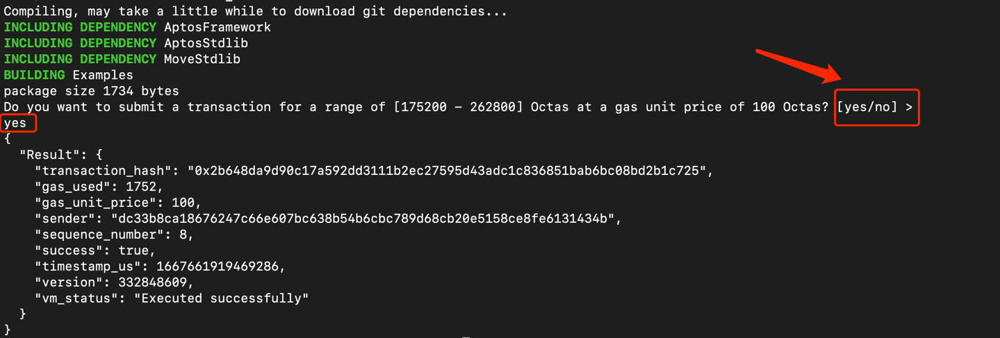
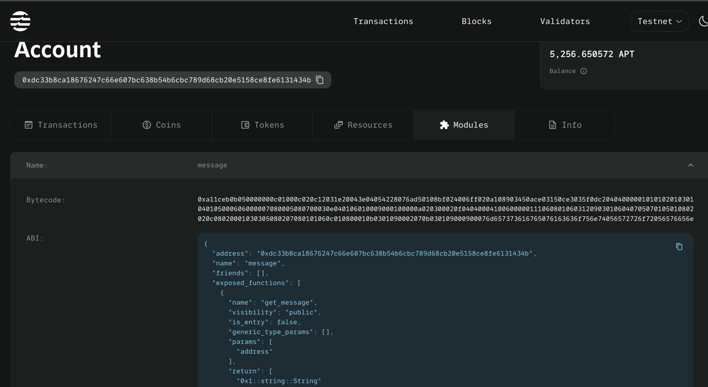

# ```move```进阶:```aptos-cli```的使用
>在[01-开发环境搭建](https://github.com/wpf008/hello_move/blob/master/01-%E6%9E%84%E5%BB%BAmove%E5%BC%80%E5%8F%91%E7%8E%AF%E5%A2%83/01-%E5%BC%80%E5%8F%91%E7%8E%AF%E5%A2%83%E6%90%AD%E5%BB%BA.md)
> 这一节我们已经成功的在本地安装了```aptos-cli```,此时我们主要是使用```aptos-cli```提供的```move```模块对我们编写的```move```程序进行编译和运行。
> 实际```aptos-cli```还有很多功能。我们将在本将展开介绍。

## 1.通过```aptos-cli help```去查看```aptos-cli```具体有哪些可用的命令选项
```shell
wpf@wpf ~ % aptos help
aptos 1.0.0
Aptos Labs <opensource@aptoslabs.com>
Command Line Interface (CLI) for developing and interacting with the Aptos blockchain
USAGE:
    aptos <SUBCOMMAND>

OPTIONS:
    -h, --help       Print help information
    -V, --version    Print version information

SUBCOMMANDS:
    account       Tool for interacting with accounts
    config        Tool for interacting with configuration of the Aptos CLI tool
    genesis       Tool for setting up an Aptos chain Genesis transaction
    governance    Tool for on-chain governance
    help          Print this message or the help of the given subcommand(s)
    info          Show build information about the CLI
    init          Tool to initialize current directory for the aptos tool
    key           Tool for generating, inspecting, and interacting with keys
    move          Tool for Move related operations
    node          Tool for operations related to nodes
    stake         Tool for manipulating stake
```
## 2.通过```aptos-cli [SUBCOMMANDS] help```去查看子命令具体有哪些可用的命令选项
```shell
aptos account help
Tool for interacting with accounts
This tool is used to create accounts, get information about the account's resources, and transfer resources between accounts.
USAGE:
  aptos account <SUBCOMMAND>
OPTIONS:
    -h, --help      Print help information

    -V, --version   Print version information
SUBCOMMANDS:
    create                        Create a new account on-chain
    create-resource-account       Create a resource account on-chain
    fund-with-faucet              Fund an account with tokens from a faucet
    help                          Print this message or the help of the given subcommand(s)
    list                          List resources, modules, or balance owned by an address
    lookup-address                Lookup the account address through the on-chain lookup table
    rotate-key                    Rotate an account's authentication key
    transfer                      Transfer APT between accounts
```

## 3.使用``aptos init```初始化本地配置
```shell
wpf@wpf ~ % aptos init
Configuring for profile default
Choose network from [devnet, testnet, mainnet, local, custom | defaults to devnet]
devnet
Enter your private key as a hex literal (0x...) [Current: None | No input: Generate new key (or keep one if present)]

No key given, generating key...
Account 3b2834f3e53ddec6c98fabe46b0204583cc1768065730386565147f9c60eeb44 doesn't exist, creating it and funding it with 100000000 Octas
Account 3b2834f3e53ddec6c98fabe46b0204583cc1768065730386565147f9c60eeb44 funded successfully

---
Aptos CLI is now set up for account 3b2834f3e53ddec6c98fabe46b0204583cc1768065730386565147f9c60eeb44 as profile default!  
Run `aptos --help` for more information about commands
{
  "Result": "Success"
}
```

### 3.1.运行```aptos config show-global-config```命令验证 CLI 是否设置为使用此本地配置YAML文件，本地YAML配置文件在.aptos/config.yaml中
```shell
wpf@wpf ~ % aptos config show-global-config
{
  "Result": {
    "config_type": "Workspace"
  }
}
```

### 3.2.更改本地配置
+ 再次执行```aptos init```命令重新配置
+ ```mac os```直接修改.aptos/config.yaml
+ ```windows``直接修改 C:/Users/xxxx/.aptos/config.yaml

## 4. account相关命令

### 4.1 水龙头获取余额 
```shell
aptos account fund-with-faucet --account <your account>
```
### 4.2 查看账号余额
```shell
aptos account list --query balance --account <your account>
aptos account list --query balance --account default
```
### 4.3 查看账号资源
```shell
aptos account list --query resources --account <your account>
aptos account list --query resources --account default
```
### 4.3 查看账号modules 
```shell
aptos account list --query modules --account <your account>
aptos account list --query modules --account default
```
### 4.4 转账
```shell
aptos account transfer --account <other account> --amount 100
```


## 5. ```privateKey```相关命令
### 5.1.生成私钥
```shell
aptos key generate --key-type ed25519 --output-file output.key
```
### 5.2.Generating a peer config
```shell
aptos key extract-peer --output-file peer_config.yaml
```


## 6. ```move```相关命令

### 6.1 编译``` Move````程序
```shell
aptos move compile --package-dir <your code dir > --named-addresses <move程序中的地址别名>=<your address>
```
```move
//sender就是move程序中的地址别名
module sender::helloworld {
    use aptos_std::debug::print;
    public fun hello() {
        print(&b"hello world");
    }
}
```
### 6.2 编译并测试``` Move```程序
```shell
aptos move test --package-dir <your code dir > --named-addresses <move程序中的地址别名>=<your address>
```

### 6.3 发布```move```程序
```shell
aptos move publish --package-dir<your code dir > --named-addresses <move程序中的地址别名>=<your address>
```

### 6.4 运行```move```程序
```shell
aptos move run --function-id <your address>::<module_name>::<method> -args <agrs>
```

### 6.5 以[hello_blockchain](https://github.com/aptos-labs/aptos-core/tree/main/aptos-move/move-examples/hello_blockchain)为例发布module到测试网

### 6.5.1 执行```aptos init```
```shell
aaptos init
```
> 分别键入```yes```、```testnet```、```your privatekey```
> 
> 保证你的地址在测试网有余额,可以去[水龙头](https://aptoslabs.com/testnet-faucet)领取
> 
 ### 6.5.2 编译hello_blockchain
```shell
aptos move test --package-dir aptos-move/move-examples/hello_blockchain --named-addresses hello_blockchain=<刚刚执行aptos init键入的私钥对应的地址>
```

### 6.5.3 发布hello_blockchain
```shell
aptos move publish --package-dir aptos-move/move-examples/hello_blockchain --named-addresses hello_blockchain=<刚刚执行aptos init键入的私钥对应的地址>
```


### 6.5.4 到[区块链浏览器](https://explorer.aptoslabs.com/blocks?network=testnet)中查看是否成功部署

>在modules下面就可以看到刚刚部署成功的合约的ABI




### 6.5.5 调用合约方法
```shell
aptos move run --function-id <刚刚执行aptos init键入的私钥对应的地址>::message::set_message --args string:hello!
```

> 至此使用```move```语言编写智能合约的编译，发布，运行，测试的整个过程都已经OK！


