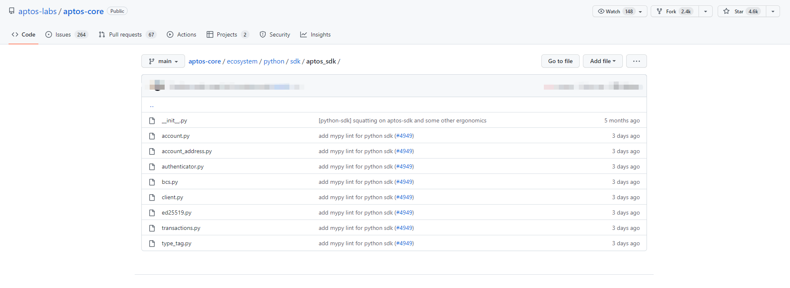

# ```move```进阶:```aptos-sdk```常用API

> ```aptos```目前提供了三种语言的```SDK```与```aptos```
> 交互。这里主要介绍[Aptos Python SDK](https://aptos.dev/sdks/python-sdk/)常用API。
> ```Python SDK``` 的主要目的是帮助```Python```开发人员快速熟悉```Aptos```并作为```Aptos```教程的辅助工具。后续有精力再推出其他两个SDK的详细讲解。
> + [Aptos Typescript SDK](https://aptos.dev/sdks/ts-sdk/index/)
> + [Aptos Python SDK](https://aptos.dev/sdks/python-sdk/)
> + [Aptos Rust SDK](https://aptos.dev/sdks/rust-sdk/)
>
> [Aptos Python SDK](https://github.com/aptos-labs/aptos-core/tree/f81ccb01f00227f9c0f36856fead4879f185a9f6/ecosystem/python/sdk/aptos_sdk)
> 提供了如下功能：
>
>

## 1. 安装```aptos-sdk```

```pip
pip install aptos-sdk
```

## 2.```client```模块相关API

```python
from aptos_sdk.client import RestClient, FaucetClient

# https://aptos.dev/guides/getting-started
DEV_NODE = 'https://fullnode.devnet.aptoslabs.com/v1'
TEST_NODE = 'https://fullnode.testnet.aptoslabs.com/v1'
MAIN_NODE = 'https://fullnode.mainnet.aptoslabs.com/v1'
DEV_Faucet_NODE = 'https://faucet.devnet.aptoslabs.com'
TEST_Faucet_NODE = 'https://aptoslabs.com/testnet-faucet'

rest_client = RestClient(DEV_NODE)
faucetClient = FaucetClient(DEV_Faucet_NODE, rest_client)
```

## 3.```account```模块相关API

```python
from aptos_sdk.account import Account

if __name__ == "__main__":
    alice = Account.generate()  # 随机生成一个账户
    print(alice.private_key)    # 用户私钥
    print(alice.public_key())  # 用户公钥
    print(alice.address())  # 用户地址
    alice.store('alice.txt')  # 将私钥和地址存入文件中
    alice = Account.load('alice.txt')  # 文件中的私钥
    alice = Account.load_key(alice.private_key)  # 文件中的私钥
```

## 4.```transaction```模块相关API
```python
from aptos_sdk.client import RestClient, FaucetClient
from aptos_sdk.account import Account

DEV_NODE = 'https://fullnode.devnet.aptoslabs.com/v1'
DEV_Faucet_NODE = 'https://faucet.devnet.aptoslabs.com'


if __name__ == "__main__":
    rest_client = RestClient(DEV_NODE)
    faucet_client = FaucetClient(DEV_Faucet_NODE, rest_client)

    alice = Account.generate()
    bob = Account.generate()

    print("\n=== Addresses ===")
    print(f"Alice: {alice.address()}")
    print(f"Bob: {bob.address()}")

    faucet_client.fund_account(alice.address(), 100_000_000)
    faucet_client.fund_account(bob.address(), 0)

    print("\n=== Initial Balances ===")
    print(f"Alice: {rest_client.account_balance(alice.address())}")
    print(f"Bob: {rest_client.account_balance(bob.address())}")

    txn_hash = rest_client.transfer(
        alice, bob.address(), 1_000)
    rest_client.wait_for_transaction(txn_hash)

    print(f"Alice: {rest_client.account_balance(alice.address())}")
    print(f"Bob: {rest_client.account_balance(bob.address())}")

    txn_hash = rest_client.bcs_transfer(alice, bob.address(), 1_000)
    rest_client.wait_for_transaction(txn_hash)

    print("\n=== Final Balances ===")
    print(f"Alice: {rest_client.account_balance(alice.address())}")
    print(f"Bob: {rest_client.account_balance(bob.address())}")

    rest_client.close()
```


## 5.```signature```模块相关API
```python
from aptos_sdk.ed25519 import PrivateKey, PublicKey, Signature
from aptos_sdk.bcs import Serializer, Deserializer

def test_sign_and_verify():
    in_value = b"test_message"
    private_key = PrivateKey.random()
    public_key = private_key.public_key()
    signature = private_key.sign(in_value)
    print(public_key.verify(in_value, signature))


def test_private_key_serialization():
    private_key = PrivateKey.random()
    ser = Serializer()
    private_key.serialize(ser)
    ser_private_key = PrivateKey.deserialize(Deserializer(ser.output()))
    print(private_key == ser_private_key)


def test_public_key_serialization():
    private_key = PrivateKey.random()
    public_key = private_key.public_key()
    ser = Serializer()
    public_key.serialize(ser)
    ser_public_key = PublicKey.deserialize(Deserializer(ser.output()))
    print(public_key == ser_public_key)


def test_signature_key_serialization():
    private_key = PrivateKey.random()
    in_value = b"another_message"
    signature = private_key.sign(in_value)
    ser = Serializer()
    signature.serialize(ser)
    ser_signature = Signature.deserialize(Deserializer(ser.output()))
    print(signature == ser_signature)


if __name__ == "__main__":
    test_sign_and_verify()
    test_private_key_serialization()
    test_public_key_serialization()
    test_signature_key_serialization()
```

----
> 至此我们学习了```aptos-sdk```常用API，我们将使用```aptos```,接下来将使用```Python SDK```与合约交互。


