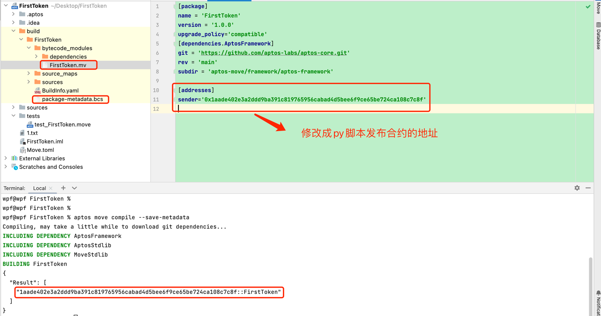
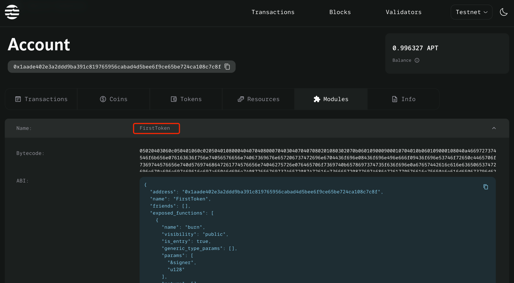

# ```move```进阶:```python aptos-sdk```与```FirstToken```合约交互

## 1. 引入相关依赖，配置客户端

```python
from aptos_sdk.client import RestClient
from aptos_sdk.account import Account
from aptos_sdk.account_address import AccountAddress
from aptos_sdk.transactions import TransactionArgument, EntryFunction, TransactionPayload
from aptos_sdk.bcs import Serializer

TEST_NODE = 'https://fullnode.testnet.aptoslabs.com/v1'
rest_client = RestClient(TEST_NODE)
resource_type = "0x1aade402e3a2ddd9ba391c819765956cabad4d5bee6f9ce65be724ca108c7c8f::FirstToken::CoinStore"
function_id = "0x1aade402e3a2ddd9ba391c819765956cabad4d5bee6f9ce65be724ca108c7c8f::FirstToken"
```


## 2. 使用SDK部署合约

### 2.1 获取```FirstToken```编译后的源文件
+ 修改```FirstToken```工程里```Move.toml``` **将地址修改成python脚本中部署所对应的账户**
+ 执行 ```shell aptos move compile --save-metadata ``` 获取编译后的源文件:[package-metadata.bcs](https://github.com/wpf008/hello_move/blob/master/python/package-metadata.bcs),[FirstToken.mv](https://github.com/wpf008/hello_move/blob/master/python/FirstToken.mv)
  

### 2.2 编写python publish脚本
```shell
# 发布合约
def publish_first_token(account: Account):
    module_path = 'FirstToken.mv'  # 自己的文件路径
    metadata_path = 'package-metadata.bcs'  # 自己的文件路径
    with open(module_path, "rb") as f:
        module = f.read()
    with open(metadata_path, "rb") as f:
        metadata = f.read()
    print("\nPublishing FirstToken package.")
    txn_hash = rest_client.publish_package(account, metadata, [module])
    rest_client.wait_for_transaction(txn_hash)
    print(txn_hash)
```
>在[区块链浏览器](https://explorer.aptoslabs.com/account/0x1aade402e3a2ddd9ba391c819765956cabad4d5bee6f9ce65be724ca108c7c8f/modules)中可以看到
>


## 3.初始化代币信息
```python
def initialize(acc: Account):
    transaction_arguments = [TransactionArgument('Kobe#Bryant', Serializer.str),
                             TransactionArgument('Kobe', Serializer.str),
                             TransactionArgument(8, Serializer.u8),
                             TransactionArgument(3364300000000, Serializer.u128)]
    payload = EntryFunction.natural(function_id, "initialize", [], transaction_arguments)
    signed_transaction = rest_client.create_single_signer_bcs_transaction(acc, TransactionPayload(payload))
    txn_hash = rest_client.submit_bcs_transaction(signed_transaction)
    rest_client.wait_for_transaction(txn_hash)
    print(txn_hash)
```


## 4.初始化CoinStore资源
````python
def register(acc: Account):
    transaction_arguments = []
    payload = EntryFunction.natural(function_id, "register", [], transaction_arguments)
    signed_transaction = rest_client.create_single_signer_bcs_transaction(acc, TransactionPayload(payload))
    txn_hash = rest_client.submit_bcs_transaction(signed_transaction)
    rest_client.wait_for_transaction(txn_hash)
    print(txn_hash)
````

## 5.铸造代币
```python
# 铸造代币
def mint(_from: Account, _to: AccountAddress,amount:int):
    transaction_arguments = [
        TransactionArgument(_to, Serializer.struct),
        TransactionArgument(amount, Serializer.u128),
    ]
    payload = EntryFunction.natural(function_id, "mint", [], transaction_arguments)
    signed_transaction = rest_client.create_single_signer_bcs_transaction(_from, TransactionPayload(payload))
    txn_hash = rest_client.submit_bcs_transaction(signed_transaction)
    rest_client.wait_for_transaction(txn_hash)
    print(txn_hash)
```

## 6.转账
```python
def transfer(_from: Account, _to: AccountAddress,amount:int):
    transaction_arguments = [
        TransactionArgument(_to, Serializer.struct),
        TransactionArgument(amount, Serializer.u128),
    ]
    payload = EntryFunction.natural(function_id, "transfer", [], transaction_arguments)
    signed_transaction = rest_client.create_single_signer_bcs_transaction(_from, TransactionPayload(payload))
    txn_hash = rest_client.submit_bcs_transaction(signed_transaction)
    rest_client.wait_for_transaction(txn_hash)
    print(txn_hash)
```
## 7.main函数
````python
if __name__ == "__main__":
    # 请自行配置合约部署对应的私钥和地址，文件内容格式：{"account_address":"your address","private_key":"your pk"}
    alice = Account.load("alice.txt")  
    bob = Account.load('bob.txt')  # 请自行配置所需私钥
    # publish_first_token(alice); #alice 部署合约 只需执行一次

    # initialize(alice)  # 初始化代币信息 必须是合约部署者 只需执行一次

    # register(alice);    #alice生产CoinStore资源 只需执行一次
    # register(bob);      #bob生产CoinStore资源 只需执行一次

    # mint(alice,alice.account_address,88888888)
    # get_balance(alice.account_address)

    # transfer(alice,bob.account_address,6666666)
    get_balance(alice.account_address)
    get_balance(bob.account_address)
````

> [完整代码](https://github.com/wpf008/hello_move/blob/master/python/FirstToken.py)


----
> 至此我们学习了如何使用```Python aptos-sdk```部署合约并与合约交互。接下来将讲解```MoveStdLib```源码解读


